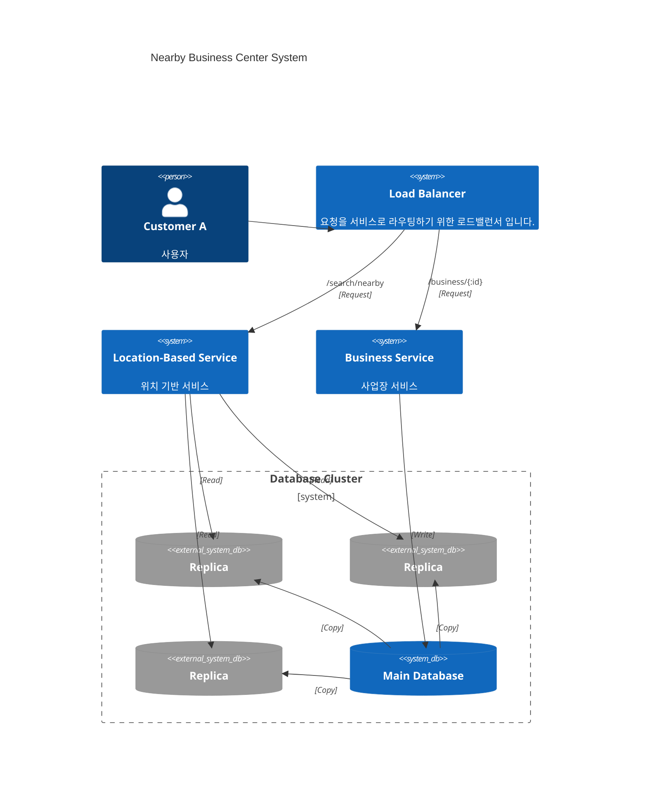
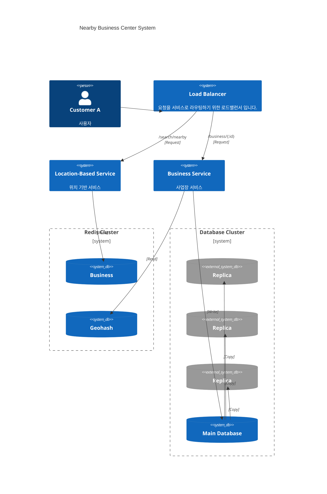

# 1장 근접성 서비스

### 문제 이해 및 설계 범위

- 사용자의 위치 (경도, 위도) 와 검색 반경 정보에 매치되는 사업장 목록 반환
- 사업장 정보 CRUD, 대신 실시간 반영 필요 X
- 사업장 정보 상세 API 필요
- Latency 최소화
- 고가용성, 확장성 대비 요구

### 개략적 설계

- business, geo_pos_index 테이블 필요
- 위치 기반 서비스, 사업장 서비스로 분리하여 로드밸런싱



- 위치 기반 서비스
    - Read only Service
    - High QPS(Query Per Second)
    - Stateless
- 사업장 서비스
    - Low QPS
    - CRUD API
    - Stateless

둘다 Stateless 서비스이기 때문에 시간대 별로 서비스 유휴 시간을 설정하기 용이하고, 국가별 가용성 구역(Region)을 설정하여 시스템 가용성을 높일 수 있다.

### 사업장 검색 시스템 알고리즘

**사전 지식 필요 : 지리적 데이터 색인을 만드는 기법들**

- 이 알고리즘 들의 공통점은, 지도 데이터를 **잘게 쪼개어 분할하고 검색 알고리즘의 복잡도를 줄이는데 있다.**
    - 해시 계열
        - **균등 격자**
        - **지오해시(Geohash)**
        - 카르테시안 계층
    - 트리 계열
        - **쿼드트리(Quadtree)**
        - **Google S2**
        - R-Tree
1. 2차원 탐색
    - 방대한 쿼리 범위, 교집합을 설정해도 역시 방대하다. DB Index 특성상 (MySQL 같은 RDB 기준) 한 차원의 데이터만 쿼리를 개선 할 수 있다. (순차적 조건절 탐색)
2. **균등 격자 기법** *
    - 실제로 게임에서 인게임 월드의 충돌 검사 범위 최적화, 시야 렌더링 컬링 범위 등 널리 사용되는 테크닉이다. 지도 검색 알고리즘 역시 검색의 범위를 줄이는 것이 목적이므로, 심플하지만 매우 효율적인 기법이라고 할 수 있다.
    - 이 시스템에서는 사업장 분포가 균등하지 않아, 밀집 구역, 사업장이 없는 구역의 격차를 찾기 어렵다.
3. **지오해시(Geohash)** *
    - 2차원 위경도 데이터를 1차원 문자열로 변환하고, 비트를 하나씩 늘려가며 재귀적으로 세상을 작은 격자로 축소해 나간다.
    - 우선 지도 범위를 사분면으로 쪼개고, 위도 범위와 경도 범위를 각 비트에 대응시켜 조합한다.
        - 위도 [-90, 0] = 0, [0, 90] = 1
        - 경도 [-180, 0] = 0, [0, 180] = 1
        - ex. 좌상단 첫 타일의 범위 - (-180, 90) ⇒ [(-180, 0) = 0][(0, 90) = 1]
            - 이렇게 위도와 경도를 대체하는 비트를 문자열 처럼 붙이면 하나의 수가 도출된다.
            - 재귀적으로 하위 레벨의 비트 또한 이런식으로 분할하여 숫자를 붙여 조합한다.
            - 이렇게 나온 지오해시 비트는 Base64 인코딩 하여 표현한다.
    - 지오해시의 인코딩 문자열의 Prefix 를 사용해서 검색 범위를 지정할 수 있다. 같은 Prefix 범위 내에 사업장이 없거나 더 멀리 있을 경우에는 **인접 타일의 범위까지 반경을 키워** 상수 시간으로 검색할 수 있다.
4. **쿼드트리(Quadtree)** *
    - 서버에서 Initialize 시점에 메모리에 상주하는 Non-Durability 자료구조이다. 쿼드트리를 구축하기 위해서는 이 시스템의 경우 사업장 분포를 먼저 가져와서 **분포 범위 별로 격자 영역을 선택적으로 쪼개면서** 트리 형태로 지도를 미리 분할하게 된다. (이때, 트리는 완전 이진 트리가 아닐 수 있음) 말단 노드를 기준으로 최종적인 해당 영역의 데이터를 도출해낸다.
    - 쿼드트리를 사용하면, 밀집지역은 더욱 작은 격자로, 비밀집지역은 큰 격자로 남기면서 미리 분할함으로써 검색범위를 효율적으로 선택할 수 있다.
    
    ```mermaid
    flowchart LR
        root((root node - 200m))
        nw((40m))
        ne((30m))
        sw((70m))
        se((60m))
        root---nw
        root-->ne
        root---sw
        root---se
        nw2((12m))
        ne2((4m))
        sw2((5m))
        se2((9m))
        nw---nw2
        ne-->ne2
        sw---sw2
        se---se2
        ne2---ne2_leaf["leaf node search business ids [1,2,5...]"]
        
    ```
    
5. Google S2
    - 빅테크 몇몇 기업이 사용하고 있는 기하 라이브러리 이다. 지오펜스 같은 가상 경계를 구현하는데 매우 유용하다.

**지오해시 vs 쿼드트리 비교**

- 지오해시
    - 구현 및 사용이 간편하고, 사업장과 연결되는 레코드만 지우면 색인 갱신도 쉽다.
    - 반경을 설정하여 범위 검색을 지원한다.
- 쿼드트리
    - 사전 트리 구현이 까다롭고, 고려할 것들이 많다.
    - 색인 갱신시, 트리 탐색이 필수(O(log n))이며, 멀티스레드 지원 시 Lock 까지 사용해야 해서 더욱 까다롭다.
    - 리밸런싱을 고려하면 구현이 더 복잡해진다.

### 상세 설계

- 데이터베이스 규모 확장성
    - 사업장 테이블
        - 데이터가 많을 경우 사업장 ID 를 기준으로 샤딩할 수 있고, 샤딩할 경우 DB 서버 부하를 분산할 수도 있어 운영에 용이하다.
    - 지리 정보 색인 테이블
        - 이 테이블에서는 (지오해시, 사업장 ID) 복합키를 저장한다. JSON 등으로 사용하면, 파싱 과정이 추가되어 연산이 많아지고 잠금이 필요하게 되어 성능이 저하된다.
        - 읽기 성능을 위한 부하 분산이 필요할 경우 레플리카 DB 서버를 몇개 두어 로드밸런싱 한다.
- 캐시
    - 가장 우선적으로, 캐시가 필요한지 질문을 던져야 한다. 그리고 지오해시에 해당하는 격자별로 사업장 ID 들을 인메모리 DB 에 저장한다. 이때, 각 사업장 ID 당 사업자 정보 객체를 가지고 있어야 한다.
- 지역 및 가용성 구역 고려하기
    - 사용자의 지역과 시스템을 가까이 하여 성능과 부하를 분산해야 한다.
    - 한국, 일본 같은 좁은 나라는 하나의 격자가 팬아웃(Fanout) 지수가 높기 때문에 인구에 비례해서 데이터센터를 적절하게 배치해야 한다.

### 최종 설계도



### 소개된 기술 및 테크닉

- 탐색 최적화 기법들
    - 2차원 검색
    - **균등 분할 격자** *
    - **지오해시** ***
    - **쿼드트리** *
    - 구글 S2
- 해당 시스템에서의 캐시 사용 전략, 데이터베이스 확장 방법