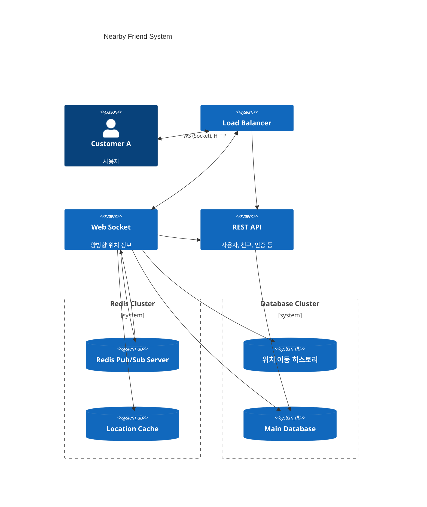

# 2장 주변 친구

1장의 근접성 서비스와의 중요한 차이점은 사업장 데이터의 경우 정보가 자주 바뀌지 않는 정적 이지만, 친구들의 위치는 수시로 변경되기 때문에 위치의 실시간 대응이 중요하다.

### 문제 이해 및 설계 범위 확정

- 사용자는 앱에서 주변 친구들의 목록을 확인할 수 있다. 친구까지의 거리, 갱신된 타임스탬프를 제공한다.
- 일정 시간마다 제공된 정보들이 모두 갱신된다.
- Latency 최소화
- 전반적인 안정성
- **결과적 일관성(eventual consistency)** * - 레플리카 갱신을 사용하는 시스템은, 원본과 동기화 될 때까지 약간의 시간동안 불일치를 용인한다. 이것은 마이크로서비스 등의 분산 레플리카 전략을 사용하는 시스템에서도 동일하게 적용되는 원칙이다.

### 개략적 설계

- 사용자 채널을 레디스 Pub/Sub 서버에 만든다. 레디스 채널은 비용이 매우 저렴하기 때문에, 일정 수준의 대용량 구독에도 버틸 수 있다.
- 사용자는 레디스 채널에 위치 갱신 정보를 퍼블리싱하고, 각 친구들은 이 사용자의 채널을 구독하고 있다가 수신하여 위치, 타임스탬프를 갱신하게 된다.
- 사용자의 위치는 영속적이지 않은 정보이고, 지속적으로 변경되기 때문에 단 하나의 레코드만을 필요로 한다. 레디스 클러스터에 이상이 생겨 캐시가 유실되어도, 결과적 일관성 원칙에 의거해서 약간의 불일치는 인용한다.

### 상세 설계

- 웹소켓 서버
    - 소켓은 유상태(Stateful) 서버이기 때문에, 기존 서버를 제거할때는 상태를 먼저 정리한 뒤에 수행해야 한다. 새로운 연결은 새 서버에 연결시키고, 기존 연결이 모두 종료되면 제거하도록 한다.
    - 레디스 채널의 비용이 저렴하므로, 친구들의 접속여부에 상관없이 모두 구독하도록 한다. 그리하여 친구들의 위치 갱신에 따라 내 친구 목록의 정보가 업데이트 된다.
- 데이터베이스
    - 레디스 서버가 아무리 성능이 좋다해도, 1K 의 활성데이터 스트리밍은 부담스러울 수 있기 때문에, 사용자 ID 별로 레디스 데이터베이스를 샤딩해서 부하를 분산하면 된다.
    - 레디스에서 지원하는 TTL 을 지정하여 활성상태가 아닌 유저의 데이터를 자동으로 삭제할 수 있다.
- **분산 레디스 펍/섭 클러스터 구독**
    - 수백개의 레디스 구독서버를 퍼블리셔인 사용자 ID 별로 샤딩하고 부하를 분산할 수 있다. 이 부하를 로드밸런싱 하는 방법으로 **아파치 주키퍼** 등의 **서비스 디스커버리(Service Discovery)** 도구를 사용할 수 있다.
    - 해시 링(Hash Ring) 기법을 사용해서 서비스들을 구성한다. 키는 레디스 서버의 ID 이고, 값은 채널의 해시들이다. 웹 소켓 서버는 해시 링을 통해 메시지를 발행할 서버를 선택하고 이후 퍼블리싱을 수행하게 된다.
    - 레디스 클러스터의 규모를 조정할 경우, 당연히 해시 링 또한 재계산이 필요하다. 그렇기 때문에, 대규모 재구독 현상을 최소화 하기 위해 서비스 이용시간이 최소화 된 시간에 수행해야 한다.
- **친구가 많을 경우 * (feat. Twitter Fanout System)**
    - 해당 시스템에서는 친구를 맺을 수 있는 **양방향 시스템**이고, 친구 수에 (약 5000 명)제한을 둔다. 클러스터들은 해시 링을 통해 **분산해서 연결**되기 때문에 레디스 클러스터에 엄청난 부담까지 주지는 않을 것이다. 하지만 만약 **단방향 팔로워 모델** 같은 문제의 경우에는 어떨까?
    - 트위터는 특정 인플루언서 (저스틴 비버, 오바마 등) 에게 일반 사용자와 다른 전략을 적용하는데, 트위터의 **팬아웃** * 시스템은 **Push, Pull 기반 팬아웃 시스템**을 **팔로워 규모에 따라 다르게 적용한다.**
    - 매우 많은 팔로워를 보유한 유명인의 경우, 트윗을 Push 하여 팔로워의 뉴스피드 캐시를 갱신한다. 이 경우 유명인이 리소스 집약적인 연산일 수 있다.
    - 중간 수준의 팔로워를 보유한 유명인의 경우, Push, Pull 전략을 적절히 조합한다.
    - 마지막으로 적은 팔로워를 보유한 사람은 Pull 전략을 사용해서 피드를 빠르게 업데이트 할 수 있다.
    - **팬아웃 - 하나의 입력이 얼마나 많은 출력에 사용되는지에 대한 정의**

### 소개된 기술 및 테크닉

- 레디스 펍/섭 클러스터를 사용한 실시간 퍼블리싱 구독 모델
- 웹 소켓과 메시지 스트리밍이 조합된 시스템 설계
- 해시 링과 서비스 디스커버리를 사용한 클러스터 구독 분산을 위한 애플리케이션 수준 로드밸런싱 전략