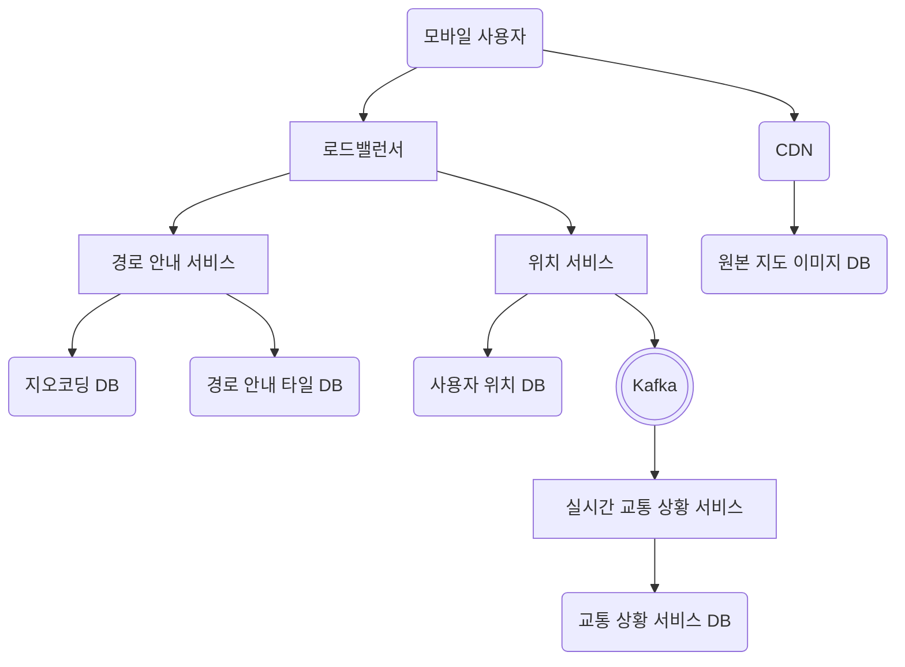

# 3장 구글 맵

### 구현 요구사항

- 사용자 위치 갱신
- 경로 안내 서비스
    - 부드러운 움직임을 요구한다.
    - 정확한 경로를 전달해야 한다.
- 지도 표시
- 사용자 디바이스 데이터 및 배터리 소비 최소화
- 가용성, 확장성 고려
- DAU 10억 커버하기

### 기능 구현을 위한 사전 지식

- 측위 시스템에 대한 이해 (위도, 경도 등)
- 3차원 ⇒ 2차원 지도 투영법 (Map Projection)
- 지오해싱, 지오코딩 보간(Interpolation) 기법
- **경로 안내 알고리즘에 대한 기본 이해**
    - **다익스트라 알고리즘 (Djikstra)** - 인접 테이블을 사용해 각 노드와 이어진 다른 노드 경로에 대한 그래프를 가지고, 간선 가중치를 따라 최소 경로를 판별하는 알고리즘
    - **A* 알고리즘** - 게임 등에서 사용되는 최소 경로 안내 알고리즘으로, 가중치 판별을 위한 **휴리스틱 알고리즘**에 따라 경로를 알려준다. 이 휴리스틱 알고리즘의 성능에 따라 A* 알고리즘의 성능이 차이가 있다.
- 계층적 경로 안내 타일
    - 지도 확대 수준 (Zoom Level) 별로 일정한 규격의 모든 타일을 가지고 있으려면 수백 PB 의 어마어마한 용량의 데이터를 가지고 있어야 한다. 이중에서 사람이 사는 밀집도에 따라 타일의 크기를 조절해서 저장하면, 90% 가량의 용량을 절약할 수 있다.

---

### 개략적 설계안



- 위치 서비스
    - 무수히 많은 클라이언트의 요청을 처리하기 위해서는, 사용자의 매초 변화하는 위치 갱신 요청 빈도를 줄여야할 필요가 있다. 그래서 일정한 간격을 두고 일괄 요청처리를 수행하는 것이 좋다.
- 경로 안내 서비스
    - A ⇒ B 로 가는 경로를 정확하게 도출하는 역할을 수행한다.
- 클라이언트 지도 이미지 서비스
    - 클라이언트는 지도를 보여주기 위해 CDN URL 을 받아야 한다. 이를 위해서는 이미 확대 수준별로 만들어 둔 지도 이미지 타일을 지오해싱 URL 로 만들어 효율적으로 내보낼 수 있다. 지오해싱 기법을 사용하므로 캐싱에도 용이하여 필요한 URL 만 만들어 줄 수 있다.
    - CloudFront 같은 리전 별 콘텐츠 전달 서비스를 사용하기 때문에 지역별로 서비스하기에 규모 확장성이 좋고 성능 또한 좋다.

### 상세 설계

**데이터 모델**

- 경로 안내 타일
    - 데이터 형태가 인접 리스트 형태인데, 확대 수준 별로 만들어야 하는데 매우 많은 용량을 차지하기 때문에 RDB, NOSQL 모두 그리 효율적인 선택은 아니다. (여러 DB 인스턴스 운영, 샤딩 작업 등 불필요한 클러스터 운영 비용 발생)
    - S3 같은 빠른 접근을 지원하는 객체 저장소에 이진 파일로 직렬화 및 저장하여 서비스 레이어 에서 캐싱까지 수행하면 효율적이다.

**서비스**

- **위치 서비스**
    - 초당 수백만 건의 위치 정보가 업데이트되기 때문에, 쓰기 성능이 좋은 NoSQL 같은 DB 를 채택한다.
    - 사용자 위치가 지속적으로 변화하여 이전 정보가 필요 없어지는 특성 때문에, CAP 정리에 따라 일관성, 가용성, 분할 내성 중 일관성 보다는 나머지에 집중한다.
    - 위치 데이터를 기반으로 AI, 교통 상황 서비스 등 여러 분야에서 활용될 수 있다. 위치 데이터를 여러 서비스에서 재활용할때는 Kafka 를 사용해서 대용량 데이터 스트리밍을 지원하도록 한다.
- **지도 표시**
    - 지도 타일은 사전에 계산하여 지원하는 확대 수준에 따라 해상도를 맞춰 만들어 두는게 좋다.
    - 기본적으로 이미지를 가져와 화면에 그대로 렌더링하면 래스터(Rasterize) 방식으로 그려지게 된다. 픽셀을 강제로 늘리기 때문에 거슬리게 보이며, 시각적으로 우아하지 않다. 이를 해결하기 위해 Vector 방식으로 그려질 정보를 대신 사용하면, 클라이언트에서 WebGL 등의 그래픽스 렌더링 기술을 사용해 직접 그리기 때문에 확대/축소 동작을 매끄럽게 제공할 수 있다.
- **경로 안내 서비스**
    
    ```mermaid
    flowchart
    	ac(모바일 사용자)
    	lb[로드밸런서]
    	ns[경로 안내 서비스]
    	gs[지오코딩 서비스]
    	nps[경로 계획 서비스]
    	rnks[순위 결정 서비스]
    	fsns[최단 경로 서비스]
    	arrs[예상 도착 서비스]
    	pss[실시간 교통 상황 서비스]
    	gdb(지오코딩 DB)
    	ndb(경로 안내 타일 DB)
    	pdb(교통량 DB)
    	udb(사용자 위치 DB)
    	ac-->lb
    	lb-->ns
    	ns-->gs
    	ns-->nps
    	gs-->gdb
    	nps-->fsns
    	nps-->rnks
    	nps-->arrs
    	fsns-->ndb
    	arrs-->pdb
    	pss-->pdb
    	pss-->udb
    ```
    
    - **적응형 ETA 와 경로 변경**
        - 적응형 ETA(Estimated Time of Arrival) 서비스는 사용자가 특정 목적지까지 도착하는 예상 시간을 제공하는 경로 안내 서비스의 한 종류이다. 현 설계는 이 적응형 ETA 서비스와 경로 변경을 허용하지 않기 때문에 교통 상황이 변경될 때마가 각 사용자의 ETA 를 변경해주어야 한다. 이를 위해 필요한 사항은 다음과 같다.
            - 현재 경로 안내를 받고 있는 사용자 추적방법
            - 모든 경로 중 교통 변화에 영향을 받는 경로와 사용자를 효율적으로 가려낼 방법
        - 경로에 영향을 받는 타일을 얻는 기본적인 방법은 모든 레코드 중 해당 타일이 존재하는 레코드를 찾는 것이다. 하지만 성능적인 효율성이 낮기 **(O(n * m))** 때문에 더 효율적인 방법을 찾아야 한다.
        - 이제 영향을 받는 타일은 확대 수준에 따라 더 낮은 타일을 포함하는 구조를 갖고 있다. 따라서, **부모 타일과 연결해서 해 놓으면 영향을 받는 타일(출발지, 목적지 타일)들이 항상 부모 타일 영역에 포함되어 있기 때문에** 검색 성능이 **O(n)** 으로 줄어든다.
    
    ### 최종 설계안
    
    ```mermaid
    flowchart
    	ac(모바일 사용자)
    	lb[로드밸런서]
    	ns[경로 안내 서비스]
    	gs[지오코딩 서비스]
    	nps[경로 계획 서비스]
    	rnks[순위 결정 서비스]
    	fsns[최단 경로 서비스]
    	arrs[예상 도착 서비스]
    	pss[실시간 교통 상황 서비스]
    	eta[적응형 ETA 및 경로 변경 서비스]
    	gdb(지오코딩 DB)
    	ndb(경로 안내 타일 DB)
    	pdb(교통량 DB)
    	udb(사용자 위치 DB)
    	udb2(활성 사용자 DB)
    	ac-->lb
    	lb-->ns
    	ns-->gs
    	ns-->nps
    	gs-->gdb
    	nps-->fsns
    	nps-->rnks
    	nps-->arrs
    	fsns-->ndb
    	arrs-->pdb
    	pss-->pdb
    	pss-->udb
    	ns-->eta
    	eta-->pdb
    	eta-->udb2
    ```
