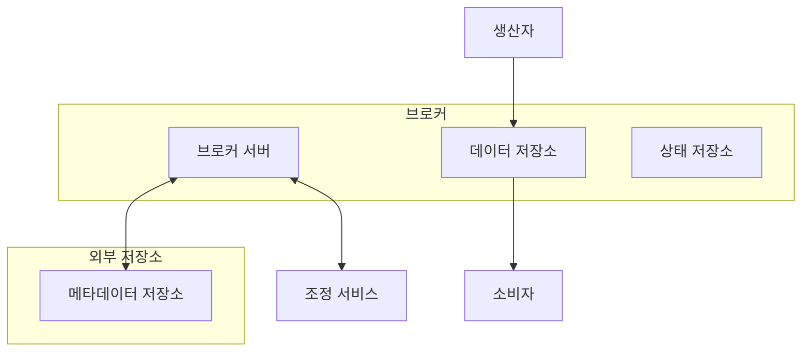

# 4장 분산 메시지 큐

### 요구사항

- 생산자 ⇒ 메시지 큐 발행, 수신자 ⇒ 메시지 큐 수신 기능을 지원해야 한다.
- 메시지는 반복적인 수신, 한 번만 수신 중 설정이 가능해야 한다.
- 메시지는 최소 한번, 최대 한번, 정확히 한번 전달 중 설정이 가능해야 한다.
- 오래된 이력은 삭제할 수 있어야 한다.
- 생산된 순서대로 수신이 되어야 한다. (부가기능)
- 높은 대역폭, 낮은 전송지연 중 설정할 수 있어야 한다.
- 내구성, 지속성 고려 - 디스크에 메시지가 보관되고, 여러 노드에 복제될 수 있어야 한다.

### 개략적 설계

**구현 모델**

- 일대일 모델 - 한 소비자가 큐에서 메시지를 소비하고 이를 알리면, 메시지가 삭제된다. 즉 소비자가 한명만 존재할 수 있는 모델
- 발행-구독 모델 - 토픽 별로 소비자에게 구독하게 한 후, 이 토픽에 발행되면 구독한 모든 소비자에게 메시지가 전달되는 1:N 모델

**발행-구독 모델의 사전 지식**

- 하나의 토픽으로 감당하기 힘들 경우, **파티션(샤딩) 기법을 구현할 수 있다.** 파티션은 분산 컴퓨팅을 위한 기법으로, 파티션을 유지하는 서버인 **브로커(Broker)**에 메시지를 균등하게 배분하여 확장성을 충족할 수 있다. 부하가 커지면 파티션을 단순히 늘리는 것으로 해결할 수 있다.
- 토픽을 구독하는 소비자는 하나 이상의 파티션에서 데이터를 가져오게 된다. 소비자가 여럿일 경우 각 소비자는 파티션의 일부를 바라보는데, 이 소비자들을 **소비자 그룹(Consumer Group)** 으로 부른다. 소비자 그룹이라는 개념은 **파티션 내의 메시지를 순서대로 소비하는 제약을 거는데 도움이 된다.** 파티션은 하나의 그룹당 하나의 소비자만 소비하게 하는 방법이다.

### 개략적 설계안

- 메타데이터 서비스 - 토픽 설정, 속성 보관
- 조정 서비스
    - 서비스 디스커버리(Service Discovery) - 실행되고 있는 브로커 탐색 기능
    - 리더 선출 - 컨트롤러 역할을 담당할 브로커 선택 및 파티션 배치 담당. 아파치 주키퍼, etcd 등이 이를 위한 컴포넌트로 주로 사용된다.

### 상세 설계

- 높은 대역폭을 위해 **배치 처리 방식**으로 I/O 프로세스를 설계한다. 소규모 I/O 가 많으면 지원하기 어렵다.
- 메시지 저장소 선택하기
    - Read / Write 연산이 매우 자주 일어나기 때문에 이러한 조건에 맞는 저장소를 골라야 한다.
    - 데이터베이스
        - 읽기, 쓰기 연산이 동시다발적으로 많이 발생하는 기능에 대해서는 충족하기 어렵다.
    - **쓰기 우선 로그 (Write-Ahead Log - WAL)**
        - 새로운 항목이 추가되기만 하는 일반 파일이다. MySQL 복구 로그, 아파치 주키퍼가 이 기술을 사용한다.
- **일괄 처리 (Batch Process)**
    - 운영체제로 하여금 메시지의 전달에 필요한 비싼 네트워크 왕복 비용을 확연하게 줄일 수 있다.
    - 큰 규모의 순차 쓰기 연산이 발생하면, 운영체제가 관리하는 디스크 캐시가 더 큰 규모의 연속된 공간을 점유하여 더 높은 디스크 접근 대역폭을 달성할 수 있다.
    - **Push & Pull 모델**
        - Push 모델
            - 브로커가 메시지를 받는 즉시 소비자에게 전달할 수 있지만, 소비자가 메시지를 처리하는 속도에 따라 부하가 걸리기 때문에, 소비자의 컴퓨팅 자원이 여유있게 준비되어 있어야 한다.
        - **Pull 모델**
            - 소비자가 메시지를 소비하는 속도를 결정하기 때문에 소비자에 따라 메시지를 수신하는 방식을 결정하도록 할 수 있다.
            - 메시지를 소비자가 소비하기 위해서는 지속적으로 브로커를 확인해야 한다. 이로 인해 컴퓨팅 자원이 낭비되기 때문에 메시지 큐가 지원하는 Long Polling 모드를 사용해서 다음 메시지 확인 루프까지 대기시간을 만든다.
- **아파치 주키퍼 (Apache Zookeeper)**
    - 계층적 키-값 저장소 기능을 제공하며, 분산 서비스를 코디네이팅 한다. 조정 서비스, 상태 저장소, 메타데이터 등의 정보를 가지고 있는 중요한 계층이다.
        - **소비자 재조정 (Consumer Rebalancing)**
            - 소비자가 어떤 파티션을 책임질지 재조정 하는 프로세스이다.
            - 재조정을 위해서는 코디네이터가 중요한 역할을 한다. 이는 ****소비자의 heartbeat 신호를 확인하고 각 소비자의 파티션 내 오프셋 정보를 관리하는 역할을 수행한다.
        - **상태 저장소**
            - 상태 저장소가 가지는 데이터 들은 다음과 같은 것들이 있다.
                - 소비자에 대한 파티션의 배치 관계 데이터
                - 각 소비자 그룹이 각 파티션에서 마지막으로 가져간 오프셋 데이터
- **사본 (Replica)**
    - 분산 시스템에서 하드웨어 장애는 흔하게 일어나므로 디스크 장애를 대비하고 가용성을 위해 복제를 많이 사용한다. 조정 서비스의 도움을 받아 리더 브로커 노드가 사본 분산 계획을 메타데이터 저장소에 보관하고, 나머지 브로커들은 이 계획대로 움직인다.
