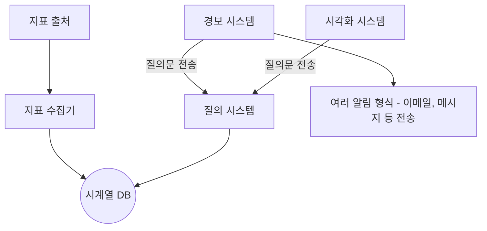
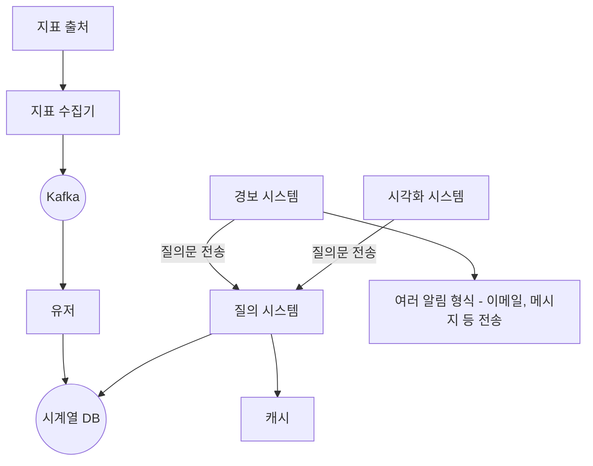

# 5장 지표 모니터링 및 경보 시스템

### 요구사항

- 대규모 인프라 모니터링
    - 일간 사용자 1억명
    - 모니터링 지표 1000 만개 수준
    - 데이터 보관 기간 1년
- 모니터링할 지표
    - CPU 사용률
    - 요청 수
    - 메모리 사용량
    - 메시지 큐 내의 메시지 수
- 질의에 대한 낮은 응답 지연
- 높은 안정성, 확장성, 유연성

### 개략적 설계

- 필요한 기능
    - 데이터 수집, 전송, 저장소
    - 경보 시스템
    - 데이터 시각화
- **데이터 저장소 시스템 설계**
    - MySQL 을 사용하기에는 성능이 매우 아쉽고, NOSql 을 고려해볼 수 있으나 확장성 있는 스키마를 설계해야 하는 비용이 크고, 이미 프로덕션 수준의 시계열 데이터베이스가 적합한 제품들이 많이 있기에 굳이 선택할 이유는 없다.
    - 시계열 데이터베이스 (**InfluxDB, Prometheus** 등) 를 사용한다. 쓰기 성능이 압도적으로 많기 때문

### 상세 설계

- **풀 vs 푸시 모델 특징 비교**
    - 풀 모델
        - 수집할 서버의 상태 진단 메서드를 호출하기만 하면 되므로 상태 확인이 쉽다.
        - TCP 연결을 사용해서 전송 지연이 조금 높다.
        - 다소 복잡한 네트워크 구성
        - 수집 대상 서버에 직접 요청하기 때문에 데이터 신뢰성이 높다.
    - 푸시 모델
        - UDP 연결을 사용하여 전송 지연이 낮다.
        - 수집 대상 서버가 보내야 하는데, 그 서버에 장애가 발생하면 상태를 알기 어렵다. 또한 인증 파이프라인이 잘 되어 있어야 신뢰성을 높일 수 있다.
- **규모 확장**
    - Kafka 를 사용하면 파티션 방식을 사용하여 대역폭을 쉽게 확장할 수 있다.
    - 데이터 수집, 처리 컴포넌트 간 결합을 낮춘다.
    - 메시지를 저장할 수 있어 DB 장애가 발생해도 자유롭다.
    - Kafka 는 모든 면에서 (비용, 구축 난이도) 높은 비용을 요구하기 때문에, 대체 가능한 시스템을 고려하면 좋다.
- **데이터 집계 지점**
    - 수집 에이전트가 집계 - 간단한 집계에 적합
    - 데이터 수집 파이프라인에서 집계 - 저장소에 기록하기 전 집계하려면 스트림 프로세싱 엔진(Flink 등)이 필요하고, 늦은 시점의 데이터 처리가 어려워 유연성, 정밀도가 아쉽다.
    - 질의 시 집계 - 전체 데이터 세트를 대상으로 즉시 집계하기 때문에 성능이 매우 느림
- **질의 서비스**
    - 시각화, 경보 시스템의 요청을 시계열 DB 를 통해 처리한다. 질의 결과를 캐싱하면 부하를 낮추고 성능을 높일 수 있다. 다만, 이미 캐시가 필요 없거나 플러그인을 지원하는 경우를 고려해야 한다.
- **저장소 계층**
    - **시계열 DB 선택시 유의사항**
        - 자주 사용하는 질의에 대해 최적화가 가능 (일반적으로, 하루 전 정도의 시간대를 가장 많이 질의)
        - 저장 용량 최적화 고려 필요 (인코딩, 다운샘플링, 콜드 스토리지 등)
- **경보 시스템**
    - Firebase, Supabase 등 올인원 BaaS (Backend-as-a-Service) 들은 알림 시스템 들을 편리하게 제공한다. (FCM 등) 이것을 만드는 비용과, 바닥부터 구현하는 비용을 잘 저울질 해야 한다.
- **시각화 시스템**
    - 오픈소스 중에서는 **Grafana** 등이 널리 쓰인다.

### 최종 설계도

