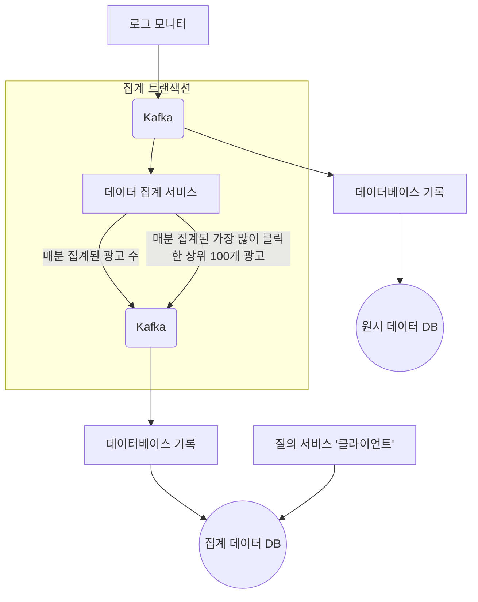

# 6장 광고 클릭 이벤트 집계

### 필요한 사전 지식

- **RTB (Real-Time Bidding, 실시간 경매)**
    - 경매 절차를 통해 광고가 나갈 지면을 거래하는 프로세스
    - 집계 데이터의 정확성이 매우 중요하다. 광고주에게 요구할 비용도 이 집계를 통해 결정된다.
    - 온라인 광고에 사용되는 핵심 지표로는 CTR(클릭률), CVR(전환률) 등이 있다.
    
    ```mermaid
    sequenceDiagram
    		box 지면 수요자 측
        participant 광고주
        participant D as DSP(수요자 플랫폼)
        end
        participant Q as 광고 거래소
        box 지면 공급자 측
        participant S as SSP(공급자 플랫폼)
        participant 공급자
        end
        광고주->>D: 
        D->>Q: 
        공급자->>S: 
        S->>Q: 
    ```
    

### 요구사항

- 지난 M 분 동안의 *_id 클릭 수 집계
- 매분 가장 많이 클릭된 상위 100개 광고 ID 반환
- 다양한 속성 집계 필터링 지원
- 집계 결과 정확성 고려 (RTB, 과금 모델에 영향), 견고성, 낮은 지연시간

**데이터 관리 구조 설계**

- 원시 데이터, 집계 데이터 모두를 저장한다. 디버깅, 백업 데이터 등 유용하게 쓰인다.
- **쓰기 중심 시스템**이고 **대용량 데이터**를 지원해야 하므로, 칼럼형 데이터 형식으로 Object Storage (AWS S3 등) 에 저장하면 최대 크기에 도달 시 새 파일을 만들어준다. 만약 이러한 부분을 잘 모르면, 카산드라 를 사용해도 된다.

### 개략적 설계

- 트래픽 대응을 위해 비동기 처리 프로세스로 설계 (MSA)
- MSA 구조에서 원자적 트랜잭션을 지원하기 위해 Kafka 사용
- 집계 서비스는 **맵리듀스(MapReduce)** 모델을 사용하는 프레임워크를 사용한다. Kafka 와 서버 노드를 사용해도 되지만, 입력 데이터 정리 및 정규화에 맵 노드가 필요하고, 중복 ID 데이터가 다른 파티션에 들어갈 수 있기 때문이다.



### 상세 설계

**구조**

- **카파 아키텍처(Kappa Architecture)** 를 사용 (일괄 처리, 스트리밍 모두 하나의 노드에서 처리)

**타임스탬프**

- 집계 시 타임스탬프로 이벤트 발생 시각을 사용
- 늦게 도착한 이벤트 처리를 위해 **워터마크(Watermark)** 기법 사용
- 집계 데이터는 **윈도우 알고리즘 (텀블링 윈도, 슬라이딩 윈도)** 을 사용하여 정기적으로 집계할 수 있다.

**집계 결과 트랜잭션**

- 정확히 한 번 트랜잭션을 일으켜야 한다. 중복 데이터는 과금 모델에 지대한 영향을 미치게 되기 때문이다.
- 트랜잭션 로직을 처리하는 부분에서는 분산 트랜잭션도 추가할 수 있다.

**확장**

- 메시지 큐 (Kafka) 확장의 경우, 소비자 그룹에 소비자를 추가하고 재조정을 거친다.
- 브로커의 경우, 토픽을 샤딩할 수 있지만 복잡성, 유지 비용이 늘어난다.
- 집계 서비스의 경우, 노드를 늘릴 수 있고 집계 프로세스를 멀티프로세싱 하는 방법도 있다.
- 카산드라 DB 의 경우, 안정 해시와 유사하게 수평적 규모 확장을 제공한다.