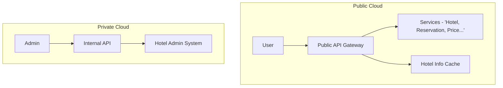

# 7장 호텔 예약 시스템

### 요구사항

- 호텔 및 객실 정보 페이지
- 객실 예약, 초과 예약 지원
- 관리자 페이지 지원
- 높은 동시성 지원

### 개략적 설계안

- 호텔, 객실, 예약 CRUD API 필요
- 예약 접수 시 reservation_id 필드를 기준으로 동시성을 위한 멱등 키로 사용하기 때문에 중요
- 관계형 데이터베이스 사용
    - 높은 트랜잭션 정합성 (ACID - 원자성, 일관성, 격리성, 영속성) 지원
    - 읽기 연산을 위한 흐름을 잘 지원

### 상세 설계안

**데이터베이스**

- 호텔과 각 호텔의 객실을 저장하는 규모는 단일 데이터베이스로 커버가 가능하지만, SPOF(단일 실패 지점) 문제를 해결하고 고 가용성을 위해 각 지역 가용 구역에 DB 를 복제하는 것이 좋다.

**동시성 문제**

- 같은 사용자가 여러 번 예약한 경우
    - 멱등 키 (idempotent Key) 기법을 사용한다. 같은 reservation_id 를 사용해 예약했을 때, 해당 키를 사용한 예약은 이미 생성되어 있기 때문에 더 이상 같은 키를 사용한 예약은 생성되지 않는다.
- 여러 사용자가 잔여 객실을 동시에 예약할 경우
    - 예를 들어 레코드가 격리되어 있지 않은 상황에서는 남은 객실이 99라고 하면, 트랜잭션 1, 2 가 동시에 발생하면 둘다 99를 읽게 된다. 여기서 트랜잭션이 커밋되면 이중 예약이 발생한다.
    - **비관적 락 (배타(X) 잠금)**
        - 잠금을 보유하고 있는 트랜잭션만 UPDATE 를 허용한다. SELECT ~ FOR UPDATE 구문으로 가져온 레코드에 잠금이 걸린다.
        - **데드락(Deadlock)**
            - 트랜잭션 1, 2 가 서로가 보유한 잠금이 걸린 레코드에 대해 읽기를 수행할 경우, 영원히 잠금이 풀리지 않게 되며 병목이 발생하는데, 이것을 데드락 이라고 한다.
            - 일부 데드락이 발생할 위험성이 있는 트랜잭션의 경우, 읽기 쿼리의 순서를 맞춰주거나 하는 방식으로 해결할 수는 있다.
        - 성능 및 확장성이 낮고, 데드락 위험성을 항상 고려해야 하기 때문에 복잡하다.
    - **낙관적 락 (애플리케이션 수준 잠금 구현)**
        - version 컬럼을 기준으로, 트랜잭션이 이 컬럼의 값을 참조하여 다음 version 값이 현재 트랜잭션에서의 version + 1 이 아닐 경우 유효성 검사가 실패하여 재시도 하도록 하는 방법이다.
        - DB 리소스에 잠금을 설정하지 않아 비관적 락보다 빠르지만, 사용자로 하여금 재시도를 하도록 유도하기 때문에 **UX 측면에서 좋지 않고**, **데이터 경합이 심할 경우 성능이 좋은 편이 아니다.**
    - **데이터베이스 제약 조건(Constraint Method)으로 해결하기**
        - 데이터베이스의 제약 조건에 조건절 함수를 설정하여 객실 수에 대한 초과 예약을 방지할 수 있다.
        - 구현이 간단하지만, 낙관적 락의 단점과 비슷한 단점이 동일하게 적용된다.

**규모 확장**

- 데이터베이스 샤딩
    - hotel_id 가 질의문의 핵심 기준이기 때문에, hotel_id 를 기준으로 샤드를 만들면 좋다.
- **캐시**
    - 예약 데이터는 지속적으로 증가하지만, **현재 - 미래 예약 데이터만 중요**하기 때문에, 이력은 Cold Storage 에 이관한 후 삭제하는 방안을 고려하는 것이 좋다.
    - 캐시도 마찬가지로 Redis 의 TTL 설정과 LRU(Least Recently Used - 가장 최근에 마지막으로 사용) 캐시 교체 정책을 통해 오래된 데이터를 지워주는게 좋다.
    - **캐시는 일관성을 유지하기 어렵다.** CDC(변경 데이터 감지) 같은 패턴을 사용해서 캐시를 업데이트 할 수 있지만, **결국 어느 정도의 불일치 시점은 반드시 존재한다.** 캐시가 높은 성능과 데이터베이스 호출 부하를 줄여주지만, UX 에 영향을 미치기 때문에 이 문제를 충분히 저울질 해야 할 것이다.

**마이크로서비스 데이터 일관성**

해당 설계안 에서는 여러 서비스로 노드를 분리하기 때문에, 마이크로서비스 아키텍처에서 사용되는 일관성 매커니즘을 도입해야 한다.

- 2PC (2단계 커밋 프로토콜) - 트랜잭션 내부에서 다른 서비스를 RPC 로 호출하고, 결과에 따라 일관성 있게  커밋을 수행하거나 모두 실패로 만든다.
- **Saga Pattern** - 트랜잭션을 각자 호출하고 커밋한다. 그리고 호출된 서비스의 실패지점이 생기면 해당 지점부터 **반환 트랜잭션**을 역순으로 수행해서 일관성을 보장해야 한다.

### 상세 설계 요약

- 관계형 데이터베이스를 사용하고, 고가용성을 위해 지역 가용 구역에 복제해 둔다.
- 동시성 제어를 위해 낙관적 락을 사용하는 것을 권장한다.
- Redis 를 사용해 호텔 객실 정보를 캐시하고 일정 시간이 지나면 이력을 삭제하도록 한다.
- 마이크로서비스 간 일관성을 위해 Saga 패턴 등을 도입한다.