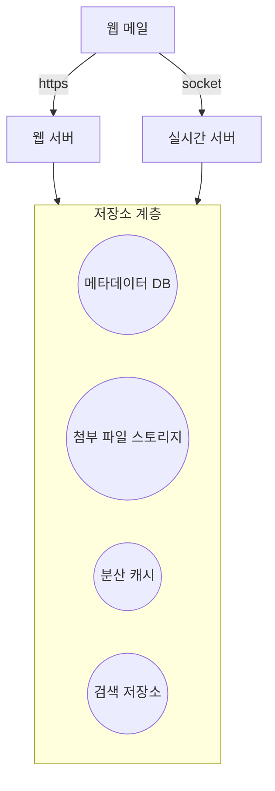

# 8장 분산 이메일 서비스

### 요구사항

- 10억명의 사용자
- 이메일 송수신
- 모든 이메일 가져오기
- 읽은 이메일 필터링
- 제목, 발신인, 메일 내용 검색 기능
- 스팸 및 바이러스 방지 기능
- 이메일 데이터 유지
- 가용성, 확장성, 유연성

### 개략적 설계안

**사전 지식**

- **이메일 프로토콜**
    - SMTP (Simple Mail Transfer Protocol) - 이메일을 한 서버에서 다른 서버로 보내는 표준 프로토콜
    - POP - 이메일 클라이언트가 원격 메일 서버에서 이메일을 수신 및 다운로드 하기 위한 표준 프로토콜
    - IMAP - POP 과 비슷하게 이메일을 수신하는데 사용하지만, 헤더만 내려받고 메일 서버에서 삭제되지 않는다. 상세 내역을 확인할때만 내용을 다운로드 한다는 차이가 있다.
    - HTTPS - 이메일 시스템의 메일함 접속을 위한 프로토콜
- **DNS**
    - MX (Mail Exchange) 레코드 검색에 이용
- **첨부 파일 지원**
    - MIME (Multi-purpose Internet Mail Extension) - 인터넷을 통해 첨부파일을 전송하는 표준 규격

**분산 메일 서버**

### 상세 설계

**메타데이터 데이터베이스**

“메타데이터의 헤더는 작고, 빈번하게 이용된다. (IMAP) 본문의 크기는 사용빈도가 낮다. 이메일 관련 작업 (읽기, 가져오기) 들은 사용자 별로 독립적이다. 안정성이 보장되어야 한다. 높은 I/O 성능을 지원해야 한다.”

위의 모든 사항들을 만족하는 데이터베이스를 고른다면, 시중에 나와 있는 솔루션 중 가장 가능성이 높은 것은 **NoSQL** 데이터베이스 일 것이다. (구글이 Bigtable 이라는 저장소를 사용하는 사례가 있기 때문) 하지만 각 메일 프로바이더들이 자체적으로 데이터베이스를 구축하는 경우가 대부분이므로, 완벽한 선택은 있을 수 없다.

- 질의 구현 시 주의사항
    - 읽음 표시를 구현하려면 데이터 모델에 is_read (Boolean) 같은 필드를 두는데, NoSQL DB 에서는 Partition Key (as PK), Culster Key (as Order Key) 만으로만 질의가 가능하므로 이러한 내부 컬럼으로는 질의할 수 없다. 이 경우, 비정규화(Denormalize)를 수행해서 읽음 여부에 따른 별도의 테이블로 옮기는 것이 방법이 될 수 있다.
- 이메일 스레드 (회신 메일 가져오기) 구현
    - JWZ 같은 알고리즘을 많이 사용하는데, 아이디어는 스레드 메일이 이메일의 원본 메일 Object ID 와 스레드에 관계된 메시지 식별자 Object ID 목록을 가지고 있으면 된다.
- 일관성 문제
    - 이메일은 데이터 정확성이 가장 중요하므로 주 사본을 통해서만 서비스되어야 하기 때문에, 가용성을 일부 희생해야 할 수 있다.

**검색**

제목, 본문의 키워드 들을 통틀어서 검색이 가능해야 한다. 또한, 발신인, 읽음 여부에 따른 고급 검색도 가능해야 한다. 이메일 시스템은 송수신 및 삭제시 마다 색인(Index) 작업이 매우 빈번하게 발생하므로, 쓰기 연산이 중요하다.

- **Elasticsearch 사용**
    - 대용량 검색에 많이 사용되는 **검색 엔진** 이다. 이메일 메일함에 변경 이벤트를 이벤트 브로커가 감지해서, 해당 내용을 검색 엔진을 구동하는 클러스터에 추가해서, 이벤트와의 결합성을 낮추고 검색은 클라이언트에서 동기로 수행하도록 한다.
- 맞춤형 검색 솔루션 구축
    - 검색을 위한 고려사항 중 중요한 부분은 I/O 병목이다. 이를 위해 검색 엔진을 사용할 수 있지만, 자체적으로 구현한다면 **LSM 트리 (Bigtable, 카산드라 등의 핵심 자료구조)** 같은 자료구조를 기반으로 한 디스크 색인 구조를 만드는 것이 좋은 전략이 될 수 있다.

**규모 확장성 및 가용성**

가용성을 확장하려면 가용 구역 별로 데이터를 다중화 하는 작업이 필요하다. 이 설계안에서는 컴포넌트의 결합도를 낮추는데 집중했기 때문에, 수평적으로 규모 확장이 가능하다.
