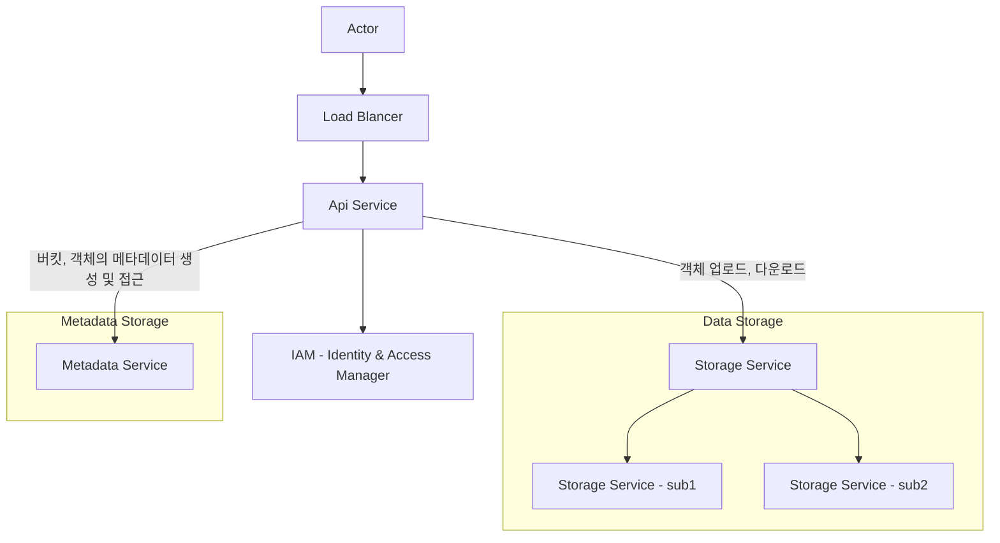
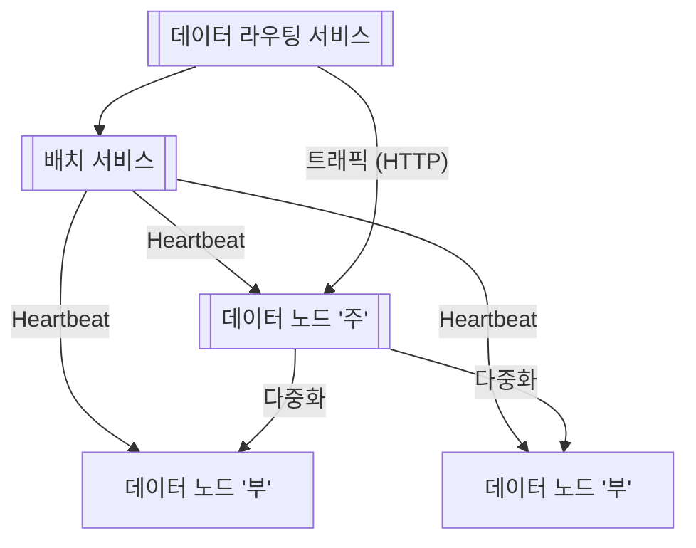

# 9장 S3와 유사한 객체 저장소

### 개략적 설계안

**객체 저장소의 속성**

- 객체 불변성 - 데이터는 변경이 불가
- 키-값 저장소 - 해당 객체의 URI 를 사용해 데이터를 가져온다.
- 저장 1회, 무제한 읽기
- 저장 객체는 크기 제한이 없음
    - UNIX 의 파일 시스템의 설계 철학과 비슷하므로 참고하면 좋다.

**객체 업로드, 다운로드**

1. 버킷 메타데이터가 없을 경우, 유저는 HTTP 요청으로 LB 를 통해 IAM 에 액세스 권한을 인증하고, 버킷 메타데이터를 생성한다.
2. 객체를 업로드 할 때는 마찬가지로 IAM 에 인증을 거친 뒤, 객체를 데이터 저장소에 보내고 Object Id (UUID) 를 생성해서 객체 메타데이터를 등록하고, 업로드 한 클라이언트에 Object Id 결과를 반환한다.
3. 다운로드 할 때는 <버킷명>/<객체명> 과 같은 논리적 계층을 가지는 URI 를 통해 액세스 할수있다.

### 상세 설계

**데이터 저장소**

- 데이터 라우터
    - 배치 서비스를 통해 최적의 저장 노드를 판단하도록 함
    - 데이터 노드를 통해 데이터 기록 및 읽기
- 배치 서비스
    - 최적의 저장 노드를 선정
    - 데이터 노드에 박동을 체크하여 장애여부를 검사한다.
    - **Paxos** 같은 **합의 프로토콜** 을 사용해 구축하는 것을 권장한다. Paxos 는 다수의 의견으로 합의하는 회의에서 나온 알고리즘으로, 일부 장애가 생겨도 서비스의 지속성을 유지하도록 한다.
- 데이터 노드
    - 객체 매핑 정보의 저장을 위해 읽기 성능이 좋은 RDB 를 사용하는데, 노드 간 공유가 필요 없으므로 노드 별 저장이 가능한 파일 기반 RDB 인 SQLite 를 사용해도 좋다.
- 데이터 내구성 보장하기
    - **데이터 다중화** - 계산이 별도로 필요 없고, 읽기-쓰기 성능이 모두 좋다.
    - **소거 코드(erasure coding)** - 패리티를 계산해서 중복성을 확보하고, 복구 시 남은 데이터를 사용해 소실된 부분을 복구한다. 이 방안은 계산이 필요하지만, 내구성과 저장소 효율성이 좋다.
- 데이터 정확성 검증
    - 체크섬(checksum) 알고리즘을 사용해서 원본 데이터의 체크섬과 동일한지 검사한다.

**메타데이터 데이터 모델링**

- bucket, object 테이블을 만들어 객체명을 기반하여 삽입-삭제하고, 객체 ID 를 찾기 위해 질의 할 수 있어야 한다. 또한 접두어를 사용해 버킷 별 객체 목록을 조회할 수 있어야 한다.
- object 테이블의 규모 확장 시, 규모가 매우 크기 때문에 단일 DB 에 저장할 수 없고, bucket name, object name 을 결합하여 샤딩하도록 한다.
    - 이 방법을 사용하면, 객체에 대한 삽입, 삭제, 질의는 지원하기 좋지만 **버킷 별 모든 객체 확인** 질의를 지원하기는 어렵다. 객체가 여러 샤드에 분산되어 있고 샤드마다 반환하는 객체가 제각각이기 때문에, 각 샤드의 추적할 오프셋이 다 다르다는 것을 의미하기 때문에 구현이 많이 복잡해진다.
    - 객체 목록을 반환하는 기능은 성능의 최적화는 크게 중요도가 높지 않기 때문에, 버킷 ID 로 샤딩하는 별도 테이블에 목록 데이터를 비정규화 해놓으면 하나의 DB 로 질의가 가능하기 때문에 구현을 단순하게 할 수 있다.

**객체 버전**

버킷 안에 한 객체의 여러 버전을 두도록 하는 기능으로, 실수로 지우거나 덮어 쓴 객체를 쉽게 복구할 수 있다. 객체의 모든 이전 버전은 메타데이터 저장소에 유지한다.

**큰 파일의 업로드 성능 최적화**

멀티파트(multipart) 업로드 방법을 사용하면, 큰 파일을 조각으로 쪼개어 업로드 과정을 반복한다. 그리고 객체 저장소는 업로드 된 조각을 모아서 원본 객체로 복원한다.

**쓰레기 수집**

더이상 사용되지 않는 다음의 데이터를 스케줄링을 통해 주기적으로 삭제해서 공간을 확보해야 한다.

- 객체의 지연 삭제 - 삭제 표시만 되어있는 객체
- 업로드 중단 조각 - 멀티파트 업로드 중단 시 이미 업로드된 조각
- 훼손된 데이터 - 체크섬 유효성 검사 실패한 데이터