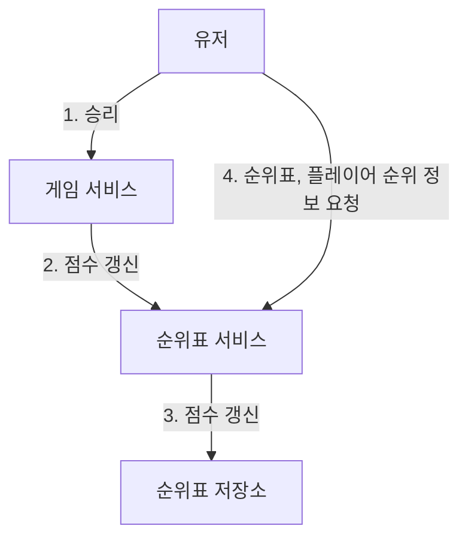
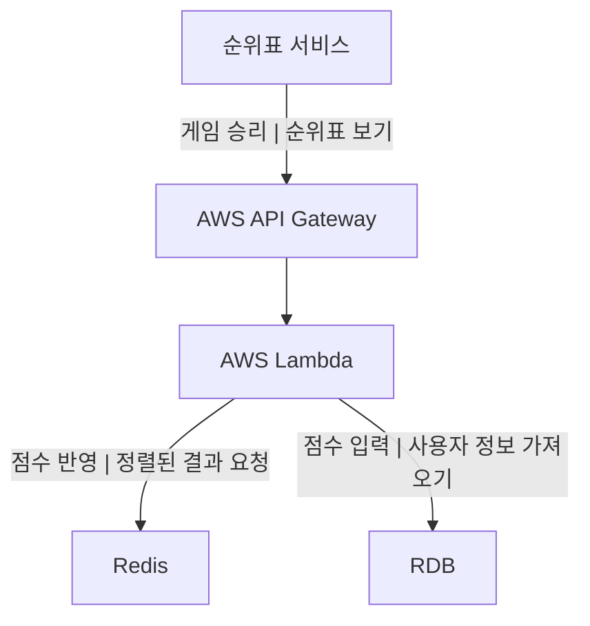

# 10장 실시간 게임 순위표

### 요구사항

- 순위표에 상위 10명의 플레이어를 표시
- 특정 사용자의 순위 표시
- 점수 업데이트는 실시간으로 순위 반영
- 기본적인 확장, 가용, 안정성

### 개략적 설계안

- 클라이언트가 서버에 직접 점수를 요청할 수도 있지만, 그렇게 되면 **프록시 서버**를 통한 중간자 공격의 위험이 있기 때문에 공정한 점수를 반영할 수 없게 된다. 따라서, 서버가 Socket 등으로 실시간으로 게임 방을 연결하고 통솔해서 클라이언트에 게임 상황 데이터를 보내주어야 한다.
- 게임 서비스에서 발생한 정보를 다른 용도로 활용해야 할 경우, 메시지 큐를 사용해 다른 서비스(알림, 분석 서비스 등)에 전달하게 할 수 있다.

**데이터 모델**

- RDB
    - 지속적인 점수 반영을 위해서는 쓰기 연산이 많이 필요하므로 캐싱이 불가능하고, 테이블 풀 스캔을 해야 하기 때문에 성능 또한 떨어지므로 실시간 서비스에서는 좋지 않다.
- Redis
    - SortedSet 자료구조를 사용하면, 순위표에 어울리는 문제 해결 방안으로 사용할 수 있다. 이 자료구조는 내부적으로 Hash Table, Skip List 두가지 자료구조를 활용해 빠른 성능을 구현한다. 참고로 Skip List 는, **중간 노드에 n차 색인을 두어 이진 탐색 처럼 건너뛰는 방법**을 사용한다.
    - 영속성을 위해서는, 자체적으로 디스크에 저장하는 기능을 제공하지만 다시 읽기 위해 인스턴스를 재시작하면 시간이 많이 걸리므로 읽기 사본 인스턴스를 두어 장애가 생기면 사본 인스턴스를 주 인스턴스로 승격시켜 연결하는 방식을 사용할 수 있다.

### 상세 설계

**클라우드 서비스 사용**

최신 게임 서비스에서는 서버리스(Serverless) 기술이 많은 각광을 받고 있다. 모바일 게임의 경우 보통 Node.js, Python 과 AWS Lambda 같은 기술을 조합해서 서버를 구성하는 것이 트렌드로 자리잡아 가고 있다.

서버리스 컴퓨팅에서는 필요할 때만 실행되며 트래픽에 따라 자동 스케일링이 지원된다.

**Redis 규모 확장**

- 데이터 샤딩 방안
    - **고정 파티션**
        - 획득한 점수의 범위 별로 샤드를 나누는 방법으로 가능
        - 상위 10명을 가져올 경우 가장 높은 점수의 범위를 커버하는 샤드에서 가져오면 된다.
        - 단, 점수가 높아져 샤드의 범위를 벗어나면 새 샤드로 옮겨야 하는 번거로움이 있다.
    - 해시 파티션
        - 나머지 연산을 통해 여러 샤드로 고르게 분산시킬 수 있다. (나머지 연산 예시 : CRC16(key) % 16384)
        - 상위 K 개를 가져올 때 수많은 데이터를 읽고 정렬까지 해야 하고, 순위를 특정할 간단한 방법이 없다.

**추가 대안 : NoSQL**

후보로는 DynamoDB, 카산드라, MongoDB 등이 있다. DynamoDB 를 사용한다고 하면, **전역 보조 색인 기능**을 제공하므로 파티션 키(PK), 정렬 키(score) 를 전역 키로 두면 테이블 풀 스캔을 방지할 수 있다.

이 대안은 Redis 의 경우와 마찬가지로, 사용자의 상대적 순위를 쉽게 파악할 수 없다. 사용자 위치의 백분위 정도 는 구할 수 있기에 이렇게 대체할 수 있다면 좋을 것 이다.