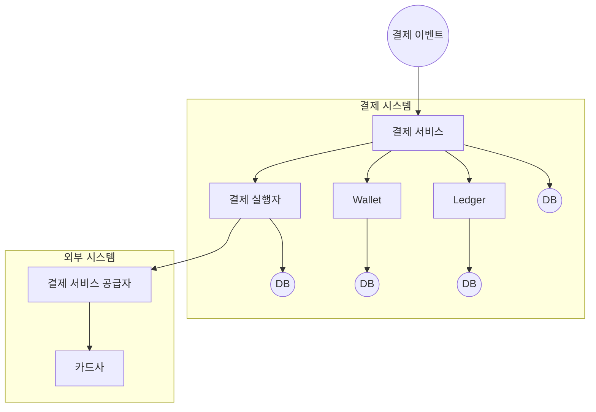

# 11장 결제 시스템

### 요구사항

- 대금 수신 파이프라인 기능
- 대금 정산 파이프라인 기능
- 신뢰성 및 내결함성
- 내부, 외부 서비스 간 조정 프로세스 (결제 정보 일치여부 비동기 체크)

### 개략적 설계안

**대금 수신 흐름**

- 결제 시스템이 결제 이벤트를 수락하면, 일반적으로 AML/CFT 같은 규정을 준수하는지, 자금 조달 및 세탁 행위를 파악하는 위험 점검(Risk Check) 을 수행한다. 위험 점검 시스템은 매우 복잡하므로 Elliptic, Certik 같은 Risk 관리를 전문으로 하는 Third Party 서비스 사용한다.
- **Ledger (원장)** - 결제 트랜잭션에 대한 금융 기록을 가진다. 결제 후 분석을 위해 중요한 역할을 한다.
- **Wallet (지갑)** - 판매자의 계정 잔액을 기록한다.



**데이터 모델링 및 API**

- **payments 도메인**
    - **payment_order_id (tx_id) 의 경우 트랜잭션을 구분하는 고유한 ID 이며, 전역적으로 유일해야 한다.** 타사 PSP 에서 중복 제거 ID 로 사용하기 때문에, 중복이 발생하면 거래가 무효처리 되기 때문이다.
    - **amount 값은 string 으로 해야 하는데**, 부동 소수점의 정밀도가 시스템마다 다르기 때문에 금액에 차이가 발생할 수 있기 때문이다. (특히 이 부분은 **암호화폐 거래 시스템**에서 두드러진다)
    
    ```mermaid
    erDiagram
        PAYMENT_ORDERS {
            string payment_order_id
            string amount
            string currency
            string seller_account
        }
    ```
    
- **데이터베이스**
    - 안전한 거래 흐름을 위해 ACID 트랜잭션을 지원하는 RDB 를 사용한다.

### TODO...